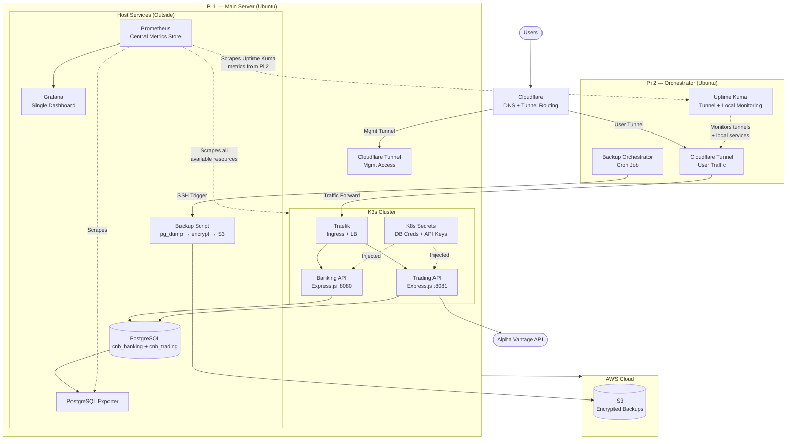
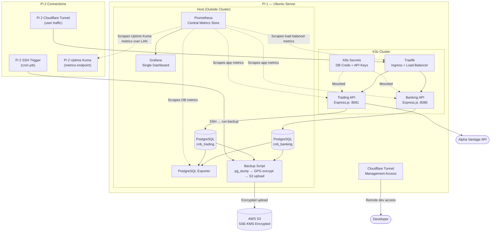
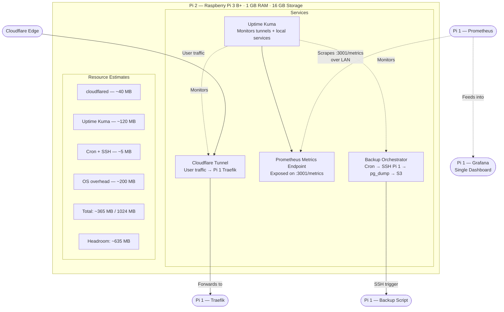

# CNB-Bank

---
## Architecture
### General Architecture Flow

```mermaid
graph TD
    Users([Users])
    CF[Cloudflare<br/>DNS + Tunnel Routing]
    
    Users --> CF
 
    subgraph Pi2["Pi 2 — Orchestrator (Ubuntu)"]
        CFT2[Cloudflare Tunnel<br/>User Traffic]
        UK[Uptime Kuma<br/>Tunnel + Local Monitoring]
        BO[Backup Orchestrator<br/>Cron Job]
    end
 
    subgraph Pi1["Pi 1 — Main Server (Ubuntu)"]
        subgraph K3s["K3s Cluster"]
            Traefik[Traefik<br/>Ingress + LB]
            Banking[Banking API<br/>Express.js :8080]
            Trading[Trading API<br/>Express.js :8081]
            Secrets[K8s Secrets<br/>DB Creds + API Keys]
        end
 
        subgraph Host["Host Services (Outside)"]
            PG[(PostgreSQL<br/>cnb_banking + cnb_trading)]
            PGExp[PostgreSQL Exporter]
            Prom[Prometheus<br/>Central Metrics Store]
            Graf[Grafana<br/>Single Dashboard]
            Backup[Backup Script<br/>pg_dump → encrypt → S3]
        end
 
        CFMT[Cloudflare Tunnel<br/>Mgmt Access]
    end
 
    subgraph AWS["AWS Cloud"]
        S3[(S3<br/>Encrypted Backups)]
    end
 
    AV([Alpha Vantage API])
 
    CF -- "User Tunnel" --> CFT2
    CF -- "Mgmt Tunnel" --> CFMT
    CFT2 -- "Traffic Forward" --> Traefik
    BO -- "SSH Trigger" --> Backup
    UK -. "Monitors tunnels<br/>+ local services" .-> CFT2
    Prom -. "Scrapes Uptime Kuma<br/>metrics from Pi 2" .-> UK
 
    Traefik --> Banking
    Traefik --> Trading
    Secrets -. "Injected" .-> Banking
    Secrets -. "Injected" .-> Trading
    Banking --> PG
    Trading --> PG
    Trading --> AV
    PG --> PGExp
    Prom -. "Scrapes all<br/> available resources" .-> K3s
    Prom -. "Scrapes" .-> PGExp
    Prom --> Graf
    Backup --> S3
    Pi1 --> AWS
```
### General Architecture Flow of PI 1

```mermaid
graph TD
    subgraph Pi1["Pi 1 — Ubuntu Server"]
        subgraph K3s["K3s Cluster"]
            direction TB
            Traefik[Traefik<br/>Ingress + Load Balancer]
            Banking[Banking API<br/>Express.js :8080]
            Trading[Trading API<br/>Express.js :8081]
            Secrets[K8s Secrets<br/>DB Creds + API Keys]
 
            Traefik --> Banking
            Traefik --> Trading
            Secrets -. "Mounted" .-> Banking
            Secrets -. "Mounted" .-> Trading
        end
 
        subgraph Host["Host (Outside Cluster)"]
            direction TB
            PG_Banking[(PostgreSQL<br/>cnb_banking)]
            PG_Trading[(PostgreSQL<br/>cnb_trading)]
            PGExp[PostgreSQL Exporter]
            Prom[Prometheus<br/>Central Metrics Store]
            Graf[Grafana<br/>Single Dashboard]
            BackupScript[Backup Script<br/>pg_dump → GPG encrypt → S3 upload]
        end
 
        CFMT[Cloudflare Tunnel<br/>Management Access]
 
        Banking --> PG_Banking
        Trading --> PG_Trading
        PG_Banking --> PGExp
        PG_Trading --> PGExp
        Prom -. "Scrapes app metrics" .-> Banking
        Prom -. "Scrapes app metrics" .-> Trading
        Prom -. "Scrapes load balancer metrics" .-> Traefik
        Prom -. "Scrapes DB metrics" .-> PGExp
        Prom --> Graf
        PG_Banking --> BackupScript
        PG_Trading --> BackupScript
    end
 
    subgraph Pi2_Inputs["Pi 2 Connections"]
        Pi2_SSH["Pi 2 SSH Trigger<br/>(cron job)"]
        Pi2_Tunnel["Pi 2 Cloudflare Tunnel<br/>(user traffic)"]
        Pi2_Kuma["Pi 2 Uptime Kuma<br/>(metrics endpoint)"]
    end
 
    Pi2_SSH -- "SSH → run backup" --> BackupScript
    Pi2_Tunnel --> Traefik
    Prom -. "Scrapes Uptime Kuma<br/>metrics over LAN" .-> Pi2_Kuma
    CFMT -- "Remote dev access" --> Dev([Developer])
    BackupScript -- "Encrypted upload" --> S3[(AWS S3<br/>SSE-KMS Encrypted)]
    Trading --> AV([Alpha Vantage API])
```

### Genaral Architecture flow of PI 2

```mermaid
graph TD
    subgraph Pi2["Pi 2 — Raspberry Pi 3 B+ · 1 GB RAM · 16 GB Storage"]
        subgraph Services["Services"]
            CFT[Cloudflare Tunnel<br/>User traffic → Pi 1 Traefik]
            UK[Uptime Kuma<br/>Monitors tunnels + local services]
            UKProm[Prometheus Metrics Endpoint<br/>Exposed on :3001/metrics]
            Cron[Backup Orchestrator<br/>Cron → SSH Pi 1 → pg_dump → S3]
        end
 
        UK -. "Monitors" .-> CFT
        UK -. "Monitors" .-> Cron
        UK --> UKProm
 
        subgraph Resources["Resource Estimates"]
            R1["cloudflared — ~40 MB"]
            R2["Uptime Kuma — ~120 MB"]
            R3["Cron + SSH — ~5 MB"]
            R4["OS overhead — ~200 MB"]
            R5["Total: ~365 MB / 1024 MB"]
            R6["Headroom: ~635 MB"]
        end
    end
 
    CF([Cloudflare Edge]) -- "User traffic" --> CFT
    CFT -- "Forwards to" --> Pi1_Traefik([Pi 1 — Traefik])
    Pi1_Prom([Pi 1 — Prometheus]) -. "Scrapes :3001/metrics<br/>over LAN" .-> UKProm
    Pi1_Prom -. "Feeds into" .-> Pi1_Graf([Pi 1 — Grafana<br/>Single Dashboard])
    Cron -- "SSH trigger" --> Pi1_Backup([Pi 1 — Backup Script])
```
